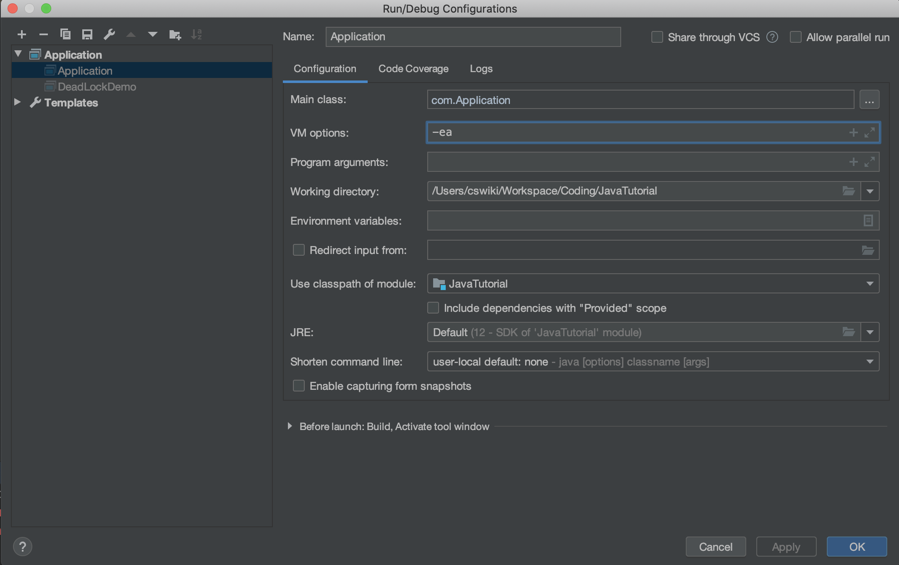

## 断言 `Assertion`
Wikipedia: https://zh.wikipedia.org/zh-cn/%E6%96%B7%E8%A8%80_(%E7%A8%8B%E5%BC%8F)
> 在程序设计中，断言（assertion）是一种放在程序中的一阶逻辑（如一个结果为真或是假的逻辑判断式），目的是为了标示与验证程序开发者预期的结果－当程序运行到断言的位置时，对应的断言应该为真。若断言不为真时，程序会中止运行，并给出错误消息。

### Java 中使用断言

* 第一种方式
    ``` java
    assert expression;
    ```
* 第二种方式
    ``` java
    assert expression1 : expression2;
    ```

* 例子
    ``` java
    assert false; /* 断言失败 */
    assert true; /* 断言成功 */
    assert 1 + 2 == 3; /* 断言成功 */

    public void setup() {
        Connection conn = getConnection();
        assert conn != null;
        /* do something */
    }

    public void setup() {
        Connection conn = getConnection();
        /* 如果第一个断言失败， 则使用第二个表达式的信息构造断言错误信息 */
        assert conn != null : "Connection is null";
    }
    ```

### 开启/关闭 `Assertion` 中的断言
默认情况下，无论是 `java` 还是 `IDE` 默认都是默认关闭断言的，我们需要手动开启。不然断言不会起作用

* 开启断言
    ``` bash
    java –ea Test
    ```
    或者
    ``` bash
    java –enableassertions Test
    ```
* `IntelliJ IDEA` 开启断言

    `Edit Configurations` -> `VM options: -> `-ea`

    

* 禁用断言
    ``` bash
    java –da Test
    ```
    或者
    ``` bash
    java –disableassertions Test
    ```

## references
> 1. https://zh.wikipedia.org/zh-cn/%E6%96%B7%E8%A8%80_(%E7%A8%8B%E5%BC%8F)<br/>
