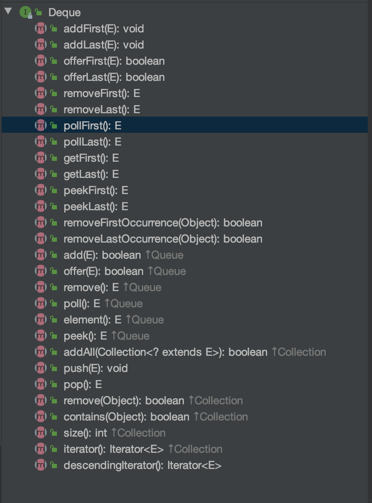

> 订阅 [TheTutorials/Java](https://github.com/TheTutorials/Java) 学习更多 Java 相关的知识

# Java 集合 - 队列


## [什么是队列](https://zh.wikipedia.org/wiki/%E9%98%9F%E5%88%97)
> 队列，又称为伫列（queue），计算机科学中的一种抽象资料型别，是先进先出（FIFO, First-In-First-Out）的线性表。在具体应用中通常用链表或者数组来实现。队列只允许在后端（称为rear）进行插入操作，在前端（称为front）进行删除操作。<br/><br/>
队列的操作方式和堆栈类似，唯一的区别在于队列只允许新数据在后端进行添加。

## 实现队列的两种方式

### 使用 Deque 接口

* 构造队列

    因为 `Deque` 是接口，所以无法初始化对应的对应，但是我们可以借助 `LinkedList`， 该类实现了 `Deque`
    ``` java
    Deque<Integer> queue = new LinkedList<>();
    ```

* 常见方法，比较简单

    

* 添加元素到队头 `add`
    ``` java
    Deque<Integer> queue = new LinkedList<>();

    IntStream.range(1, 6).forEach(queue::add); /* 依次添加1-5 到队列中 */
    assert queue.toString().equals("[1, 2, 3, 4, 5]");
    ```

* 队头部删除元素
    ``` java
    Deque<Integer> queue = new LinkedList<>();
    IntStream.range(1, 6).forEach(queue::add); /* 依次添加1-5到队列中 */

    assert queue.remove() == 1 && queue.removeFirst() == 2; /* 依次删除对头的1和2 */
    assert queue.poll() == 3 && queue.pollFirst() == 4; /* 依次删除头部的3和4 */
    assert queue.toString().equals("[5]");
    ```

* 获取队头和队尾的元素值
    ``` java
    Deque<Integer> queue = new LinkedList<>();
    IntStream.range(1, 6).forEach(queue::add); /* 依次添加1-5到队列中 */

    assert queue.peek() == 1
            && queue.peekFirst() == 1
            && queue.peekLast() == 5;
    ```
* 求队列长度和判断队列是否为空
    ``` java
    Deque<Integer> queue = new LinkedList<>();
    IntStream.range(1, 6).forEach(queue::add); /* 依次添加1-5到队列中 */

    assert queue.size() == 5;
    while (!queue.isEmpty()) {
        queue.pop();
    }
    assert queue.isEmpty();

    try {
        queue.pop();
        assert false; /* 该语句不会执行 */
    } catch (NoSuchElementException e) {
        assert true; /* 该语句一定执行 */
    }
    ```

## references
1. https://zh.wikipedia.org/wiki/%E9%98%9F%E5%88%97