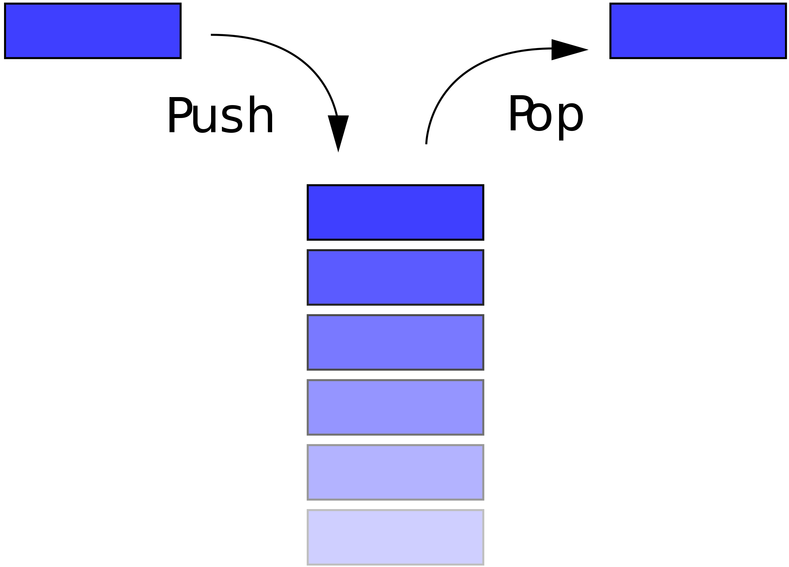

> 订阅 [TheTutorials/Java](https://github.com/TheTutorials/Java) 学习更多 Java 相关的知识

# Java 集合栈

## [什么是栈](https://zh.wikipedia.org/wiki/%E5%A0%86%E6%A0%88)
> 堆栈（英语：stack）又称为栈或堆叠，是计算机科学中的一种抽象资料类型，只允许在有序的线性资料集合的一端（称为堆栈顶端，英语：top）进行加入数据（英语：push）和移除数据（英语：pop）的运算。因而按照后进先出（LIFO, Last In First Out）的原理运作。



## Java 集合类 `Stack`

* `Stack` 类的声明
    ``` java
    public
    class Stack<E> extends Vector<E> {
    ```
    可以发现 `Stack` 类继承 `Vector` 并且实现类范型操作。

* `Stack` 构造函数
    ``` java
    Stack<Integer> stack = new Stack<>();
    ```
* `Stack` 常用方法
    ``` java
    public static void main(String[] args) {
        Stack<Integer> stack = new Stack<>();
        assert stack.empty(); /* 判断栈是否是空的 */
        IntStream.range(1, 6).forEach(stack::push); /* 依次把1-5压入栈中 */
        assert stack.size() == 5; /* 计算栈的长度 */
        assert stack.pop() == 5 && stack.peek() == 4; /* 5位于栈顶，首先被弹出，接下来4位于栈顶 */
        assert stack.search(3) == 2; /* 3位于栈中的第三个位置，下标为2 */

        /* 弹出栈中的所有元素 */
        while (!stack.empty()) {
            stack.pop();
        }

        assert stack.empty(); /* 所有元素弹出后栈为空 */
    }
    ```

## 栈的应用
* [括号匹配](https://github.com/TheAlgorithms/Java/blob/master/DataStructures/Stacks/BalancedBrackets.java)
* [进制转换](https://github.com/TheAlgorithms/Java/blob/master/DataStructures/Stacks/DecimalToAnyUsingStack.java)
## references
1. https://zh.wikipedia.org/wiki/%E5%A0%86%E6%A0%88