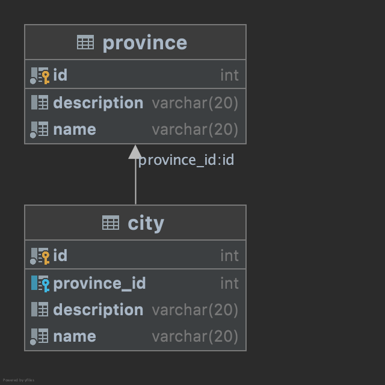
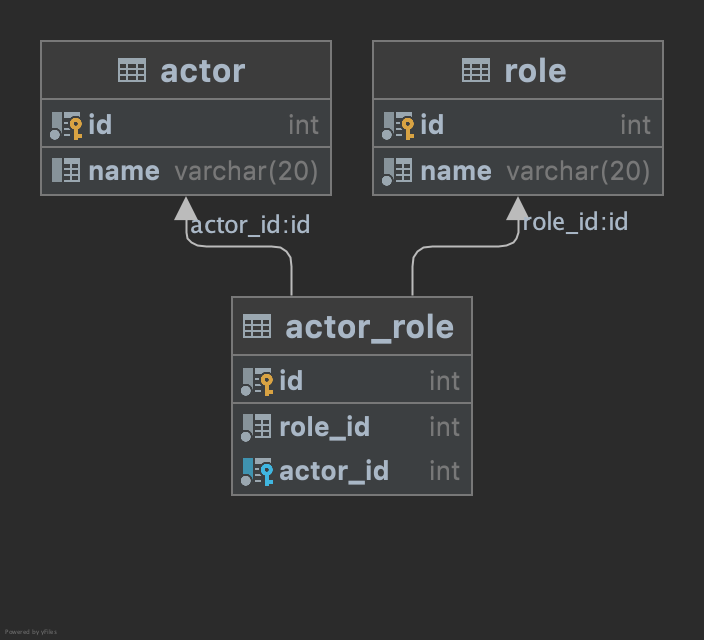

# MYSQL 基础

## 安装MYSQL
Mac OS
1. [下载MYSQL](https://dev.mysql.com/downloads/mysql/)

## 配置 MYSQL 环境变量

## 登陆 MYSQL
``` bash
mysql -uroot -p112233 # 提供用户名和密码
mysql -uroot -p # 未提供密码
mysql -h127.0.0.1 -uroot -p112233 # 提供服务器地址
```

## 启动 MYSQL
* Windows 
    ``` shell
    net start mysql(mysql-name)
    ```
## 停止 MYSQL
* Windows 
    ``` shell
    net stop mysql(mysql-name)
    ```

## 显示所有数据库
``` sql
show databases;
SHOW DATABASES; -- 不区分大小写
```

## 注释
``` sql
show databases; -- 注释内容
show databases; # 单行注释
show databases; /* 多行注释 */
```

## DDL
资料定义语言（data definition language，DDL）属于DBMS语言的一种

## [DML](https://zh.wikipedia.org/wiki/%E8%B3%87%E6%96%99%E6%93%8D%E7%B8%B1%E8%AA%9E%E8%A8%80)
数据操纵语言（Data Manipulation Language, DML）是用于数据库操作，对数据库其中的对象和资料执行访问工作的编程语句，通常是数据库专用编程语言之中的一个子集，例如在信息软件产业通行标准的SQL语言中，以INSERT、UPDATE、DELETE三种指令为核心，分别代表插入(意指新增或创建)、更新(修改)与删除(销毁)。在使用数据库的系统开发过程中，其中应用程序必然会使用的指令；而加上 SQL的SELECT语句，欧美地区的开发人员把这四种指令，以“CRUD”(分别为 Create, Retrieve, Update, Delete英文四前缀字母缩略的术语)来称呼；而亚洲地区使用汉语的开发人员，或可能以四个汉字：增 查 改 删 来略称。

## [DQL](https://en.wikipedia.org/wiki/Data_query_language)
数据查询语言


## [DCL](https://zh.wikipedia.org/wiki/%E8%B3%87%E6%96%99%E6%8E%A7%E5%88%B6%E8%AA%9E%E8%A8%80)
资料控制语言 (Data Control Language) 在SQL语言中，是一种可对资料访问权进行控制的指令，它可以控制特定用户账户对资料表、查看表、存储程序、用户自定义函数等数据库对象的控制权。由 GRANT 和 REVOKE 两个指令组成。

## CRUD解释
* C: create 创建
* R: retrieve 查询
* U: update 更新
* D: delete 删除

## 创建数据库
``` sql
CREATE DATABASE db;
CREATE DATABASE db1 CHARACTER SET UTF8; # 指定编码
```

## [显示数据库编码](https://stackoverflow.com/questions/1049728/how-do-i-see-what-character-set-a-mysql-database-table-column-is)
``` sql
SELECT default_character_set_name
FROM information_schema.SCHEMATA
WHERE schema_name = "db";
或者
SHOW CREATE DATABASE db;
```

## 切换数据库
``` sql
USE db; # 切换数据库到db
```

## 显示正在使用的数据库
``` sql
SELECT DATABASE();
```

## 显示所有数据库
``` sql
SHOW DATABASES;
```

## 默认数据库的简单介绍

## 修改数据库编码
``` sql
ALTER DATABASE db CHARACTER SET UTF8;
```

## 删除数据库
``` sql
DROP DATABASE db;
```

## 常见数据类型
* int 整形
* double 浮点型
* varchar 字符串类型（可变字符串)
* char 字符串类型(固定长度)

## 创建表
<details>
<summary>例题: 创建用户表(学号，用户名，用户密码)<br/>
</summary>

``` sql
CREATE TABLE user
(
    uid      int,
    username varchar(20),
    password varchar(20)
);
```
</details>

<details>
<summary>例题: 创建用户表(学号，用户名，用户密码，身高，生日)<br/>
</summary>

``` sql
CREATE TABLE user
(
    uid      int,
    username varchar(20),
    password varchar(20),
    height   double,
    birthday date
);
```
</details>

<details>
<summary>例题: 创建和 user 表结构相同的表<br/>
</summary>

``` sql
CREATE TABLE user_like like user;
```
</details>

## 描述表结构
``` sql
DESC user;
```

## 显示所有表
``` sql
SHOW TABLES;
```

## 显示创建表的SQL语句
``` sql
SHOW CREATE TABLE user;
```

## 删除表
``` sql
DROP TABLE user_like; # 永久删除
DROP TABLE if exists user; # 如果存在再删除
```

## 修改表的名字
``` sql
RENAME TABLE user TO new_user;
```

## 修改表的编码
``` sql
ALTER TABLE user CHARACTER SET GBK;
```

## 表添加一列
``` sql
ALTER TABLE user ADD age int; # 添加年龄列
```

## 修改表字段的类型
``` sql
ALTER TABLE user
    MODIFY password CHAR(100);
```

## 修改表字段的名称及类型
``` sql
ALTER TABLE user
    CHANGE uid user_id VARCHAR(20);
```

## 删除表字段
``` sql
ALTER TABLE user
    DROP age;
```

## 插入数据记录
``` sql
INSERT INTO user(id, username, password, height, birthday)
VALUES (1, 'jack', '112233', 1.85, '2099-11-25'); # 插入所有字段

INSERT INTO user
VALUES (1, 'tom', 'abc123', 1.95, '2094-11-25'); # 不指定字段名

INSERT INTO user(id, username, password)
VALUES (3, 'jerry', '12345678'); # 指定部分字段

INSERT INTO user(id, username, password, height, birthday)
VALUES (4, NULL, NULL, NULL, NULL); # 插入空值
```

## 修改字段的值
``` sql
UPDATE user SET birthday = '2008-8-1'; # 更新所有记录
UPDATE user SET birthday = '2099-1-1' WHERE id = 1; # 更新特定条件对应的列

UPDATE user
SET username = 'admin',
    password = '123',
    birthday = '2029-12-30'
where id = 1; # 同时修改多列的值
```

## 删除数据
``` sql
DELETE
FROM user
where id = 1; # 删除满足条件的记录

DELETE
FROM user; # 删除所有记录

TRUNCATE user; # 删除整个表，再创建一张以模样的表
```

## 数据查询
``` sql
SELECT * FROM employer; # 查询所有记录所有字段

SELECT name, salary
FROM employer; # 只查询部分字段

SELECT id        AS `编号`,
       name      AS 姓名,
       sex       AS 性别,
       salary    AS '工资',
       hire_date AS '入职时间'
FROM employer; # 为查询的结果指定别名，AS可以省略

SELECT DISTINCT sex
FROM employer; # 去重

SELECT name, salary - 1000 AS '降薪1000元后的薪资'
FROM employer; # 修改查询到的记录
```

<details>
<summary>例题: 查询薪水为18000的员工信息<br/>
</summary>

``` sql
SELECT *
FROM employer
where salary = 18000; 
```
</details>

<details>
<summary>例题: 查询用户名为 admin 的信息<br/>
</summary>

``` sql
SELECT *
FROM employer
where name = 'admin';
```
</details>

<details>
<summary>例题: 查询薪水不为18000的员工信息(方式一)<br/>
</summary>

``` sql
SELECT *
FROM employer
where salary != 18000;
```
</details>

<details>
<summary>例题: 查询薪水不为18000的员工信息(方式二)<br/>
</summary>

``` sql
SELECT *
FROM employer
where salary != 18000;
```
</details>

<details>
<summary>例题: 查询薪水小于18000的员工信息<br/>
</summary>

``` sql
SELECT *
FROM employer
where salary < 18000;
```
</details>

<details>
<summary>例题: 查询薪在10000-15000之间的员工信息(方式一)<br/>
</summary>

``` sql
SELECT *
FROM employer
where salary between 10000 and  15000;
```
</details>

<details>
<summary>例题: 查询薪在10000-15000之间的员工信息(方式二)<br/>
</summary>

``` sql
SELECT *
FROM employer
where salary >= 10000 AND salary <= 15000;
```
</details>

<details>
<summary>例题: 查询薪在为16000或17000的员工信息(方式一)<br/>
</summary>

``` sql
SELECT *
FROM employer
where salary = 16000 OR salary = 17000;
```
</details>

<details>
<summary>例题: 查询薪在为16000或18000的员工信息(方式二)<br/>
</summary>

``` sql
SELECT *
FROM employer
where salary in (16000, 18000);
```
</details>

<details>
<summary>例题: 查询所有用户名含root的员工信息<br/>
</summary>

``` sql
SELECT *
FROM employer
where name like '%root%';
```
</details>

<details>
<summary>例题: 查询所有用户名含root开头的员工信息<br/>
</summary>

``` sql
SELECT *
FROM employer
where name like 'root%';
```
</details>

<details>
<summary>例题: 查询所有用户名第2个字符为r的员工信息<br/>
</summary>

``` sql
SELECT *
FROM employer
where name like '_r%';
```
</details>

<details>
<summary>例题: 查询性别为空的所有员工信息<br/>
</summary>

``` sql

SELECT *
FROM employer
where sex IS NULL;
```
</details>

<details>
<summary>例题: 查询性别不为空的所有员工信息<br/>
</summary>

``` sql

SELECT *
FROM employer
where sex IS NOT NULL;
```
</details>

## 排序
<details>
<summary>例题: 按照薪水升序排序<br/>
</summary>

``` sql
SELECT *
FROM employer
ORDER BY salary ASC; # ASC 可以省略
```
</details>

<details>
<summary>例题: 按照薪水降序排序<br/>
</summary>

``` sql
SELECT *
FROM employer
ORDER BY salary DESC;
```
</details>

<details>
<summary>例题: 按照薪水降序，编号降序排序<br/>
</summary>

``` sql
SELECT *
FROM employer
ORDER BY salary, id DESC;
```
</details>

## 聚合函数
<details>
<summary>例题: 统计记录数(方式一)<br/>
</summary>

``` sql
SELECT count(*)
FROM  employer;
```
</details>

<details>
<summary>例题: 统计记录数(方式二)<br/>
</summary>

``` sql
SELECT COUNT(1)
FROM employer;
```
</details>

<details>
<summary>例题: 统计记录数(方式三)<br/>
</summary>

``` sql
SELECT COUNT(id)
FROM employer; # 空值不会被记录
```
</details>

<details>
<summary>例题: 查询总薪水，最高薪水，最低薪水，平均薪水<br/>
</summary>

``` sql
SELECT SUM(salary) AS '总薪水',
       MAX(salary) AS '最高薪水',
       MIN(salary) AS '最低薪水',
       AVG(salary) AS '平均薪水'
FROM employer; # 不会统计空值
```
</details>

<details>
<summary>例题: 统计薪资大于10000的个数<br/>
</summary>

``` sql
SELECT COUNT(*)
FROM employer
WHERE salary > 10000;
```
</details>


<details>
<summary>例题: 统计男性的人数<br/>
</summary>

``` sql
SELECT COUNT(*)
FROM employer
WHERE sex = '男';
```
</details>

<details>
<summary>例题: 统计男性的平均薪资<br/>
</summary>

``` sql
SELECT AVG(salary) AS '男性平均薪资'
FROM employer
WHERE sex = '男';
```
</details>

## 分组
<details>
<summary>例题: 求男性和女性的平均薪资<br/>
</summary>

``` sql
SELECT sex, AVG(salary)
FROM employer
GROUP BY sex;
```
</details>

<details>
<summary>例题: 显示所有的员工的所有学历<br/>
</summary>

``` sql
SELECT education
FROM employer
GROUP BY education;
```
</details>

<details>
<summary>例题: 查询每种学历的平均薪资<br/>
</summary>

``` sql
SELECT education AS '学历', AVG(salary) '平均薪资'
FROM employer
GROUP BY education;
```
</details>

<details>
<summary>例题: 查询每种学历的平均薪资大于10000的学历<br/>
</summary>

``` sql
SELECT education AS '学历', AVG(salary) '平均薪资'
FROM employer
GROUP BY education
HAVING AVG(salary) > 10000;
```
</details>

## LIMIT 关键词
<details>
<summary>例题: 查询前3条记录<br/>
</summary>

``` sql
SELECT * FROM employer LIMIT 3;
```
</details>

<details>
<summary>例题: 查询从第3条记录开始，查询5条记录<br/>
</summary>

``` sql
SELECT *
FROM employer
LIMIT 2, 5;
```
</details>

## 主键约束

<details>
<summary>例题: 主键约束(方式一)<br/>
</summary>

``` sql
CREATE TABLE user
(
    id       int PRIMARY KEY,
    username VARCHAR(20),
    password VARCHAR(20)
);
```
</details>

<details>
<summary>例题: 主键约束(方式二)<br/>
</summary>

``` sql
CREATE TABLE user
(
    id       INT,
    username VARCHAR(20),
    password VARCHAR(20),
    PRIMARY KEY (id)
);
```
</details>

<details>
<summary>例题: 主键约束(方式三)<br/>
</summary>

``` sql
CREATE TABLE user
(
    id       INT,
    username VARCHAR(20),
    password VARCHAR(20)
);

ALTER TABLE user
    ADD PRIMARY KEY (id);
```
</details>

<details>
<summary>例题: 删除主键<br/>
</summary>

``` sql
ALTER TABLE user
    DROP PRIMARY KEY;
```
</details>

<details>
<summary>例题: 主键自增<br/>
</summary>

``` sql
CREATE TABLE user
(
    id       INT PRIMARY KEY AUTO_INCREMENT,
    username VARCHAR(20),
    password VARCHAR(20)
);
```
</details>

<details>
<summary>例题: 指定主键自增的起始值<br/>
</summary>

``` sql
CREATE TABLE user
(
    id       INT PRIMARY KEY AUTO_INCREMENT,
    username VARCHAR(20),
    password VARCHAR(20)
) AUTO_INCREMENT = 2022;
```
</details>

DELETE 和 TRUNCATE 对主键自增的影响

* DELETE 删除后，下次插入的主键接着最后一条被删除的主键
* TRUNCATE 删除后，主键从1开始

## 非空约束
``` sql
CREATE TABLE user
(
    id       INT PRIMARY KEY AUTO_INCREMENT,
    username VARCHAR(20) NOT NULL,
    password VARCHAR(20) NOT NULL
);
```

## 唯一约束
``` sql
CREATE TABLE user
(
    id       INT PRIMARY KEY,
    username VARCHAR(20) NOT NULL UNIQUE,
    password VARCHAR(20) NOT NULL

);
```

## 默认值
``` sql
CREATE TABLE user
(
    id       INT PRIMARY KEY AUTO_INCREMENT,
    username VARCHAR(20) NOT NULL UNIQUE,
    country  VARCHAR(20) DEFAULT 'China'
);
```

## 手动开启事务
``` sql
start transaction ;
INSERT INTO user(username, password)
VALUES ('admin', '112233');
INSERT INTO user(username, password)
VALUES ('jack', 'abc123');
commit ;
```

## 自动提交事物
注意: MYSQL 默认是开启自动提事务的
* 显示 MYSQL 事务是否自动提交
    ``` sql
    SHOW VARIABLES like 'autocommit';
    ```
* 关闭自动提交事务
    ``` sql
    SET @@AUTOCOMMIT=OFF;
    ```
* 开启自动提交事务
    ``` sql
    SET @@AUTOCOMMIT=ON;
    ```

## 事务的四大特性
* 原子性
* 一致性
* 隔离性
* 持久性

## 并发访问常见异常
* 脏读
* 不可重复读
* 幻读

## MYSQL 事务隔离级别

* 查看事务隔离级别
    ```` sql
    show  variables like 'transaction_isolation'
    ````

## 外键约束

* 创建外键约束
    ``` sql
    CREATE TABLE dept
    (
        id       int PRIMARY KEY AUTO_INCREMENT,
        name     varchar(20) NOT NULL,
        location varchar(20) NOT NULL
    );


    CREATE TABLE employee
    (
        id      INT PRIMARY KEY AUTO_INCREMENT,
        name    VARCHAR(100) NOT NULL,
        sex     VARCHAR(10),
        salary  DOUBLE       NOT NULL,
        dept_id INT,
        CONSTRAINT emp_dept_fk FOREIGN KEY (dept_id) REFERENCES dept (id)
    );
    ```

* 删除外键约束
    ``` sql
    ALTER TABLE employee
        DROP FOREIGN KEY emp_dept_fk;
    ```

* 给已有表添加外键约束
    ``` sql
    ALTER TABLE employee
        ADD CONSTRAINT emp_dept_fk FOREIGN KEY (dept_id) REFERENCES dept (id);
    ```

## 级联删除
* 创建表实现级联删除
    ``` sql
    CREATE TABLE dept
    (
        id       int PRIMARY KEY AUTO_INCREMENT,
        name     varchar(20) NOT NULL,
        location varchar(20) NOT NULL
    );

    CREATE TABLE employee
    (
        id      INT PRIMARY KEY AUTO_INCREMENT,
        name    VARCHAR(100) NOT NULL,
        sex     VARCHAR(10),
        salary  DOUBLE       NOT NULL,
        dept_id INT,
        CONSTRAINT emp_dept_fk FOREIGN KEY (dept_id) REFERENCES dept (id)
            ON DELETE CASCADE
    );
    ```
* 为已有表添加级联删除
    ``` sql
    ALTER TABLE employee DROP FOREIGN KEY emp_dept_fk;
    
    ALTER TABLE employee
        ADD CONSTRAINT emp_dept_fk FOREIGN KEY (dept_id) REFERENCES dept (id) ON DELETE CASCADE;
    ```

## 表之间的关系
* 一对一
* 一对多
    <details>
    <summary>例题: 省份和城市<br/>
    </summary>

    ``` sql
    CREATE TABLE city
    (
        id          INT PRIMARY KEY AUTO_INCREMENT,
        name        VARCHAR(20) NOT NULL,
        description VARCHAR(20) DEFAULT NULL,
        province_id INT,
        CONSTRAINT city_province_fk FOREIGN KEY (province_id) REFERENCES province (id)
    );


    CREATE TABLE city
    (
        id          INT PRIMARY KEY AUTO_INCREMENT,
        name        VARCHAR(20) NOT NULL,
        description VARCHAR(20) DEFAULT NULL,
        province_id INT,
        CONSTRAINT city_province_fk FOREIGN KEY (province_id) REFERENCES province (id)
    );
    ```
    
    </details>
* 多对多
    <details>
    <summary>例题: 演员和角色<br/>
    </summary>

    ``` sql
    CREATE TABLE actor
    (
        id   INT PRIMARY KEY AUTO_INCREMENT,
        name VARCHAR(20) NOT NULL
    );

    CREATE TABLE role
    (
        id   INT PRIMARY KEY AUTO_INCREMENT,
        name VARCHAR(20) NOT NULL
    );

    CREATE TABLE actor_role
    (
        id       INT PRIMARY KEY AUTO_INCREMENT,
        actor_id INT NOT NULL,
        role_id  INT NOT NULL
    );

    ALTER TABLE actor_role
        ADD FOREIGN KEY (actor_id) REFERENCES actor (id);

    ALTER TABLE actor_role
        ADD FOREIGN KEY (role_id) REFERENCES role (id);

    ```
    
    </details>

## 多表查询
``` sql
CREATE TABLE category
(
    id   INT PRIMARY KEY AUTO_INCREMENT,
    name VARCHAR(20) NOT NULL
);

CREATE TABLE product
(
    id          INT PRIMARY KEY AUTO_INCREMENT,
    NAME        VARCHAR(20) NOT NULL,
    price       DOUBLE      NOT NULL,
    category_id INT,
    FOREIGN KEY (category_id) REFERENCES category (id)
);
```

<details>
<summary>例题: 笛卡尔积<br/>
</summary>

``` sql
SELECT *
FROM product,
     category;
```
</details>

<details>
<summary>例题: 查询商品信息和对应的分类信息<br/>
</summary>

``` sql
SELECT *
FROM product,
     category
WHERE product.category_id = category.id;
```
</details>

<details>
<summary>例题: 查询商品名称，价格，及分类<br/>
</summary>

``` sql
SELECT p.NAME AS '商品名称', p.price AS '商品价格', c.name AS '商品分类'
FROM product p,
     category c
WHERE p.category_id = c.id;
```
</details>

<details>
<summary>例题: 查询苹果手机所在的分类信息<br/>
</summary>

``` sql
SELECT p.NAME AS '商品名称', c.name AS '商品分类'
FROM product p,
     category c
WHERE p.category_id = c.id AND p.NAME like '%Iphone%';
```
</details>

<details>
<summary>例题: 左外连接<br/>
</summary>

``` sql
SELECT *
FROM category
         LEFT JOIN product p on category.id = p.category_id
```
</details>

<details>
<summary>例题: 查询每个分类下的商品数量<br/>
</summary>

``` sql
SELECT *
FROM product p
         right join category c on c.id = p.category_id;
```
</details>

## 子查询
<details>
<summary>例题: 查询最便宜的商品信息<br/>
</summary>

``` sql
SELECT *
FROM product
where price = (SELECT MIN(price) FROM product);
```
</details>

<details>
<summary>例题: 查询手机分类下的商品名称和价格<br/>
</summary>

``` sql
SELECT p.NAME '商品名称', p.price '商品价格'
FROM product p
WHERE p.category_id = (SELECT c.id FROM category c WHERE c.name = '手机')
```
</details>

<details>
<summary>例题: 查询商品价格大于10000元的商品名称，价格，分类信息<br/>
</summary>

``` sql
SELECT p.NAME '商品名称', p.price '商品价格', c.name '商品分类'
FROM product p
         INNER JOIN (SELECT * FROM category) c
WHERE p.category_id = c.id
  AND p.price > 10000;
```
</details>

<details>
<summary>例题: 查询商品价格大于10000的商品分类名称<br/>
</summary>

``` sql
SELECT name
FROM category
WHERE id IN (SELECT category_id FROM product WHERE price > 10000)
```
</details>

<details>
<summary>例题: 查询手机分类和电脑分类的下的所有商品信息<br/>
</summary>

``` sql
SELECT *
FROM product
WHERE category_id IN (SELECT id FROM category WHERE category.name IN ('手机', '电脑'))
```
</details>

## 数据库设计三范式

## 数据设计反三范式