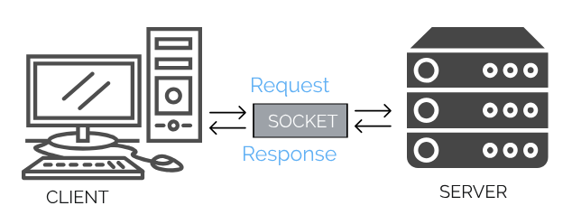

> 订阅 [TheTutorials/Java](https://github.com/TheTutorials/Java) 学习更多 Java 相关的知识

# Socket 编程
本章节我们使用 `Socket` 实现一个简单的智能对话系统，包括客户端 (`Client`), 服务器端 (`Server`)



## 服务器端 (`Server`)

* 构造函数

    我们必须必须在服务器端创建一个 `ServerSocket`，便于客户端的链接
    ``` java
    ServerSocket serverSocket = new ServerSocket(8888);
    ```

* 开始监听

    创建完成 `ServerSocket` 后服务器端并未开始监听， 我们需要使用 `accept()` 方法开始监听本地端口，该方法会一直阻塞，直到有客户端连接。并返回一个客服端实例。
    ``` java
    Socket socket = serverSocket.accept();
    ```

* 获取输入输出流

    ``` java
    DataInputStream receiver = new DataInputStream(socket.getInputStream());
    DataOutputStream sender = new DataOutputStream(socket.getOutputStream());
    ```

* 通过 `read` 和 `write` 方法分别读入客服端发送的数据和向客服端写入数据

    ``` java
    receiveMsg = receiver.readUTF();
    sender.writeUTF(msg);
    ```

## 客服端 (`Client`)
客服端要和服务器端建立连接，客服端必须要知道到服务器主机的地址(`ip`), 如果客服端和服务器在同一台电脑上面，那么服务器地址就是本机地址: `localhost` 或者 `127.0.0.1`.以及需要直到服务器端所监听的端口号。端口号的范围 `0-65535`，0到1023范围内的端口号是众所周知的端口或系统端口，所以我们尽量使用1024及以上的端口号。

* 构造函数
    ``` java
    Socket(String host, int port)
    ```
* 获取输入和输出流

    无论是客服端还是服务器端，我们都可以获取彼此的输入输出流，便于和服务端和客服端之间的交流。
    ``` java
    DataOutputStream sender = new DataOutputStream(socket.getOutputStream());
    DataInputStream receiver = new DataInputStream(socket.getInputStream());
    ```

## 完整代码

<details>
<summary>Client</summary>

``` java
import java.io.DataInputStream;
import java.io.DataOutputStream;
import java.io.IOException;
import java.net.Socket;
import java.util.Scanner;

public class Client {

    public static void main(String[] args) throws IOException {
        Client client = new Client("127.0.0.1", 8888);

        Scanner scanner = new Scanner(System.in);
        while (true) {
            String msg = scanner.nextLine();
            String receiveMsg = client.sendMessage(msg);
            System.out.println(receiveMsg);
            if (receiveMsg.equals("Bye Bye!")) {
                break;
            }
        }
    }

    private Socket socket;
    private DataOutputStream sender;

    public Client(String host, int port) {
        try {
            this.socket = new Socket(host, port);
            sender = new DataOutputStream(socket.getOutputStream());
        } catch (IOException e) {
            e.printStackTrace();
        }
    }

    public String sendMessage(String msg) throws IOException {
        sender.writeUTF(msg);
        DataInputStream receiver = new DataInputStream(socket.getInputStream());
        return receiver.readUTF();
    }
}
```
</details>

<details>
<summary>Server</summary>

``` java
import java.io.DataInputStream;
import java.io.DataOutputStream;
import java.io.IOException;
import java.net.ServerSocket;
import java.net.Socket;

public class Server {
    public static void main(String[] args) {
        new Server();
    }

    private static final String[][] words = {
            {"Hi!", "Hi!"},
            {"How are you ?", "I'm fine. Thanks"},
            {"I love you!", "I love you too ^_^."}
    };

    private Server() {

        try {
            ServerSocket serverSocket = new ServerSocket(8888);
            System.out.println("Server started");
            Socket socket = serverSocket.accept();
            System.out.println("a client connected this server now.");

            DataInputStream receiver = new DataInputStream(socket.getInputStream());
            DataOutputStream sender = new DataOutputStream(socket.getOutputStream());

            String receiveMsg;
            do {
                receiveMsg = receiver.readUTF();
                System.out.println("Client says: " + receiveMsg);
                boolean exists = false;
                for (String[] word : words) {
                    if (word[0].equals(receiveMsg)) {
                        sender.writeUTF(word[1]);
                        exists = true;
                    } else if (receiveMsg.toLowerCase().contains("bye")) {
                        sender.writeUTF("Bye Bye!");
                        exists = true;
                    }
                }
                if (!exists && !receiveMsg.equals("Over")) {
                    sender.writeUTF("I don't know what you say!");
                }
            } while (!receiveMsg.equals("Over"));
        } catch (IOException e) {
            e.printStackTrace();
        }
    }
}
```
</details>

注意: 必须先运行 `Server` 再运行 `Client`
